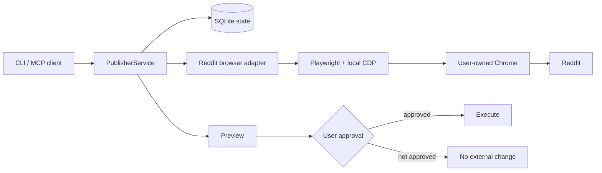

# Reddit Agent Publisher

[](https://github.com/Bl0ck154/reddit-agent-publisher/actions/workflows/ci.yml)

**User-controlled Reddit workflow tooling for MCP clients and browser-based integrations.**

Reddit Agent Publisher connects a narrow application interface to a Reddit session that you control in Chrome. Authentication stays in the browser while the service manages local drafts, previews, approvals, and audit state.

The design is explicitly human-in-the-loop:

**prepare → preview → approve → execute**

## Highlights

- MCP server and command-line interface
- Reddit posts, comments, edits, and deletes
- subreddit rules and post flair discovery
- live browser preview before an external change
- expiring approval tied to the current preview digest
- local SQLite state and hash-chained audit events
- persistent user-owned Chrome session
- local-only Chrome DevTools connection
- OpenAPI 3.1 contract for optional integrations

## Architecture



## Requirements

- Node.js 22+
- npm
- Chrome, Chromium, or Chrome for Testing
- a Reddit account

## Install

```bash
git clone https://github.com/Bl0ck154/reddit-agent-publisher.git
cd reddit-agent-publisher
npm install
npm run build
```

The public edition connects to a **local Chrome DevTools endpoint**. Chrome is started and controlled by the user; the application does not manage browser credentials or the browser lifecycle.

Default endpoint: `http://127.0.0.1:9222`

Override it with `PUBLISHER_CDP_URL` when using another local port.

## MCP

After building, point your MCP client at:

```text
node /absolute/path/reddit-agent-publisher/dist/mcp.js
```

## Security model

Approval is bound to a specific preview digest and expires. Edit/delete operations use canonical Reddit targets, the CDP endpoint must be local, and account-level write locking prevents concurrent mutations.

## Development

```bash
npm install
npm run build
npm test
```

## Notes

This project is not affiliated with Reddit. Reddit can change its website UI without notice, so browser-facing selectors may require maintenance. CAPTCHA, 2FA, consent, and account challenges remain manual browser interactions.

## License

MIT
