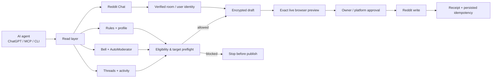

# Reddit Agent Publisher

[](https://github.com/Bl0ck154/reddit-agent-publisher/actions/workflows/ci.yml)
[](https://github.com/Bl0ck154/reddit-agent-publisher/releases/latest)
[](LICENSE)
[](package.json)

> **A self-hosted, agent-safe control layer for a real Reddit account.**
>
> Let ChatGPT, Codex, Claude/MCP clients, or your own agent **read Reddit context, inspect the real notification bell, understand subreddit eligibility, work with Reddit Chat/DMs, and publish through your authenticated browser** — without handing the agent your Reddit password and without turning every retry into a duplicate post or message.

**Reddit Agent Publisher is not just another Reddit API wrapper.** It connects an AI agent to the surfaces a logged-in Reddit user actually sees: modern Shreddit pages, the notification bell, subreddit rules/flairs, your own activity, and Reddit Chat. Writes are bound to exact targets, previewed against the live UI, and guarded by an owner-controlled publish state machine.

```text
Agent understands the request
        ↓
reads exact Reddit context / bell / chats / rules
        ↓
eligibility + safety preflight
        ↓
prepares the exact target + content
        ↓
live browser preview
        ↓
owner/platform approval when required
        ↓
publish once
        ↓
receipt + idempotent retry protection
```


## Why this exists

Most Reddit integrations solve one of two problems:

1. **Read Reddit for an LLM** — search, browse posts, fetch comments.
2. **Call Reddit's API as a bot/script** — create a post or comment with API credentials.

Reddit Agent Publisher is aimed at a different problem:

> **How do you let an AI agent operate your real Reddit account with enough context to make good decisions, while keeping targeting, approval, authentication, and retries under control?**

That means the project cares about things a simple API wrapper usually does not: the exact comment being replied to, whether AutoModerator already removed your last three attempts, whether the account has enough **comment** karma rather than total karma, whether a DM target is the exact top commenter you asked for, whether a message request already exists, and whether a previous send may actually have succeeded before the client lost the response.

## What makes it different

### 🔔 It reads the real Reddit notification bell

The publisher can read current Reddit bell announcements through authenticated **GET-only Shreddit routes**, then load full AutoModerator/moderation announcement details when useful.

That lets an agent see messages such as:

```text
YOUR COMMENT HAS BEEN REMOVED
Reason: You need 300+ COMMENT karma and a 2 month old account.
Comment karma is NOT post karma or total karma.
```

The reader does **not** open the bell UI or send a mark-as-read mutation. When Reddit does not expose a deterministic read/unread bit, the result is explicitly reported as `read_state: unknown` instead of being guessed.

### 🧠 It understands eligibility before wasting a publish attempt

Before a Reddit post/comment, the publisher can combine:

- separate **comment karma**, **post karma**, and **total karma**
- account age
- subreddit rules
- subreddit description / submit text
- target post title/context when rules are conditional
- recent AutoModerator/moderator notices from bell + inbox

High-confidence unmet requirements are enforced **before the form is submitted**. A blocked destination returns `SUBREDDIT_ELIGIBILITY_BLOCKED` with the detected requirement and live account value.

So an agent can handle a request like:

> “Post this everywhere it is allowed.”

without blindly hammering a subreddit that already told the account it needs 300 comment karma.

### 💬 It supports current Reddit Chat and direct messages

This is not limited to posts/comments. The publisher also works with Reddit's current Chat backend:

- list existing Reddit Chat conversations
- read one exact room
- read pending incoming message requests without accepting them
- download exact image/file/video/audio attachments
- reply to an exact returned room
- send a direct message by verified Reddit username
- bind a username to an optional `t2_...` user id before sending
- reuse an existing direct room instead of creating a duplicate
- accept an existing incoming request only at authorized publish time
- send one protected attachment with optional text

A flow such as **“find the actual top commenter and DM them”** can resolve the top comment with `sort=top`, carry its exact `author` + `author_fullname`, verify the recipient again, then send to that user — with no silent substitution to a different commenter.

### 🛡️ It treats retries as a correctness problem

Reddit writes and Reddit Chat sends are mutation-safe:

- persisted mutation intents survive process restarts
- stable transaction IDs are reused across retries
- direct-message and room-id retry paths can deduplicate the same logical send
- ambiguous server outcomes are recovered before retrying creation
- a successful confirmed publish can be queried by status instead of blindly resubmitted

This matters when an agent, network, browser, or tool layer times out **after Reddit already accepted the write**.

### 👤 Authentication stays in your browser

The browser-backed workflow does not require the agent to know your Reddit password, 2FA code, CAPTCHA answer, or Reddit app secret.

You log into Reddit normally in an owner-controlled Chrome profile. The publisher reuses that authenticated session. Manual auth challenges stay in the browser where they belong.

## A different category from typical Reddit MCP servers

There are other Reddit MCP projects, including read-only tools and API-based projects with write support. Reddit Agent Publisher does **not** claim that nobody else can post to Reddit from MCP.

The distinction is the combination of browser-native account control, Reddit Chat, bell awareness, eligibility checks, exact live previews, and mutation safety.

| Capability | Reddit Agent Publisher | Typical read-only Reddit MCP | Typical API-first write MCP* |
| --- | --- | --- | --- |
| Read posts/comments | ✅ | ✅ | ✅ |
| Use existing logged-in browser session | ✅ | Usually no | Usually no |
| No Reddit app credentials for core browser workflow | ✅ | Sometimes | Usually no for writes |
| Create posts/comments | ✅ | ❌ | ✅ |
| Edit/delete exact own content | ✅ | ❌ | Often |
| Live Reddit form preview before publish | ✅ | N/A | Usually no |
| Exact canonical target binding | ✅ | Read-only | Varies |
| Current Reddit Chat / DMs | ✅ | Usually no | Usually no |
| Chat attachments + pending requests | ✅ | Usually no | Usually no |
| Read current Reddit bell | ✅ | Usually no | Usually no |
| Full AutoModerator removal detail | ✅ | Usually no | Usually no |
| Karma/account-age eligibility preflight | ✅ | Usually no | Usually no |
| Persisted anti-duplicate publish/send intents | ✅ | N/A | Varies |
| Human-in-the-loop approval model | ✅ | N/A | Varies |
| Fail closed when Reddit behavior is ambiguous | ✅ | N/A | Varies |

*This is a category comparison, not a claim about every project. Implementations vary.*

## Real agent workflows

| You ask | Publisher can do |
| --- | --- |
| **“Why did my comments disappear?”** | Read the bell → load full AutoModerator detail → correlate subreddit + target → explain the exact rule. |
| **“Post this everywhere I can.”** | Check each destination → compare live karma/account age to rules → skip blocked subreddits → publish eligible ones. |
| **“Find the top commenter and DM them.”** | Read thread with `sort=top` → take exact `author` + `t2_` id → verify direct target → reuse/create the correct Reddit Chat room → send once. |
| **“Reply to my newest Reddit DM and attach this file.”** | List chats → load exact room → inspect incoming media/request state → bind attachment → preview → authorized send. |
| **“Reply to the newest comment on my last post.”** | Find recent own activity → load exact thread → identify newest returned comment → prepare exact reply target → live preview. |
| **“Retry that message.”** | Reuse persisted mutation intent / transaction identity instead of creating a duplicate side effect. |

## Feature map

### Read and understand

- **Exact thread context** — post, nested comments, targeted comment, top/newest/oldest top-level shortcuts
- **Recent own activity** — locate your latest posts/comments without manually pasting permalinks
- **Legacy inbox** — replies and messages
- **Current notification bell** — Shreddit bell cards + full important announcement details
- **Subreddit rules and flairs** — read before posting
- **Live self profile** — separate comment/post/total karma and account age
- **Reddit Chat** — conversations, message requests, messages, participant usernames, attachments

### Publish and interact

- **Text posts**
- **Link posts**
- **1–4 image posts**
- **Top-level comments**
- **Replies to exact comments**
- **Edit own post/comment text**
- **Delete exact own post/comment targets**
- **Reddit Chat replies**
- **Direct messages by verified username / `t2_` identity**
- **Chat image/file/video/audio attachment sends**

### Safety and reliability

- **Automatic subreddit eligibility preflight**
- **Live preview before browser submission**
- **Digest-bound approval**
- **Preview expiry**
- **Canonical permalink targeting**
- **Exact Reddit user identity binding for DMs**
- **One-account mutation lock**
- **Encrypted local draft payloads (AES-256-GCM)**
- **Persisted mutation intents**
- **Cross-retry idempotency**
- **Ambiguous outcome recovery**
- **Fail-closed UI behavior**
- **Hash-chained local audit events**

## Architecture



The CLI, MCP server, and GPT Actions gateway all talk to the same long-running daemon, so they share the same browser session, encrypted state, previews, mutation locks, and retry semantics.

## Current Reddit UI: live-tested

The project is maintained against the current Reddit web stack rather than an abstract mock UI.

Recent hardening includes:

- modern Shreddit `faceplate-form` / Lexical post-comment flows
- exact nested comment reply targeting
- authenticated Shreddit notification bell routes
- full notification announcement detail pages
- current Reddit Chat Matrix endpoints and `reddit_dm` room creation
- existing-room and incoming-request recovery
- browser-stored Chat credentials plus current Shreddit token fallback
- live account identity binding between Reddit browser session and Chat sender

The adapter intentionally stops with structured errors such as `SITE_CHANGED`, `AUTH_REQUIRED`, `SUBREDDIT_ELIGIBILITY_BLOCKED`, or Chat-specific terminal errors instead of guessing through changed UI.

See [CHANGELOG.md](CHANGELOG.md).

## Quick start

Requirements: **Node.js 22+**, npm, and Chrome/Chromium.

```bash
git clone https://github.com/Bl0ck154/reddit-agent-publisher.git
cd reddit-agent-publisher
npm ci
npm run build
```

Create the local encryption key once:

```bash
mkdir -p "$HOME/.local/share/reddit-agent-publisher"
openssl rand 32 > "$HOME/.local/share/reddit-agent-publisher/master.key"
chmod 600 "$HOME/.local/share/reddit-agent-publisher/master.key"
export PUBLISHER_MASTER_KEY_FILE="$HOME/.local/share/reddit-agent-publisher/master.key"
```

### Easiest browser mode: your own local Chrome

```bash
google-chrome \
  --remote-debugging-address=127.0.0.1 \
  --remote-debugging-port=9222 \
  --user-data-dir="$HOME/.reddit-agent-publisher-chrome"
```

Log in to Reddit manually in that Chrome window, then:

```bash
export PUBLISHER_CDP_URL=http://127.0.0.1:9222
npm start
```

In another shell, with the same environment:

```bash
node dist/cli.js status
node dist/cli.js reddit-activity --limit 10
node dist/cli.js reddit-preflight GiftofGames --action comment
node dist/cli.js reddit-thread 'https://www.reddit.com/r/example/comments/abc123/example/'
node dist/cli.js reddit-inbox
node dist/cli.js prepare reddit-post --subreddit test --title "Hello" --body "Preview me first"
```

For on-demand managed Chrome profiles and idle shutdown, see [Browser modes](docs/browser-modes.md).

## ChatGPT / Custom GPT Actions

The owner-only HTTP Actions gateway exposes both non-consequential context reads and consequential publish operations.

### Read-only Actions

- `getPublisherStatus`
- `getRedditPreflight`
- `getRedditRules`
- `getRedditFlairs`
- `getRedditThread`
- `getMyRedditActivity`
- `getRedditInbox`
- `getRedditNotifications`
- `getRedditChats`
- `getRedditChatMessages`
- `getRedditChatAttachment`
- `getPublicationStatus`

### Consequential publish Actions

- `publishRedditPost`
- `publishRedditComment`
- `publishRedditEdit`
- `publishRedditChatReply`
- `publishRedditDirectMessage`
- `publishPublication` — legacy publish for an already-bound preview

### Preview-only Actions

- `previewRedditPost`
- `previewRedditComment`
- `previewRedditEdit`
- `previewRedditDelete`
- `previewRedditChatReply`
- `previewRedditDirectMessage`

Image posts can receive 1–4 images directly from the current ChatGPT conversation. Reddit Chat sends can bind one protected conversation attachment with optional text.

Setup: [ChatGPT / Custom GPT Actions](docs/gpt-actions.md)

Recommended GPT instructions: [actions/gpt-instructions.md](actions/gpt-instructions.md)

## MCP

After starting `publisherd`, point your MCP client at `dist/mcp.js`:

```json
{
  "mcpServers": {
    "reddit-agent-publisher": {
      "command": "node",
      "args": ["/absolute/path/reddit-agent-publisher/dist/mcp.js"]
    }
  }
}
```

Useful Reddit-specific MCP tools include:

### Context / safety

- `reddit_preflight`
- `reddit_rules`
- `reddit_flairs`
- `reddit_thread_get`
- `reddit_my_activity`
- `reddit_inbox`
- `reddit_notifications`

### Reddit Chat

- `reddit_chat_list`
- `reddit_chat_get`
- `reddit_chat_attachment_get`
- `reddit_chat_reply_prepare`
- `reddit_direct_message_prepare`

### Writes

- `reddit_post_prepare`
- `reddit_comment_prepare`
- `reddit_reply_prepare`
- `reddit_edit_prepare`
- `reddit_delete_prepare`

The generic `publication_prepare` tool remains for backward compatibility. MCP uses the same daemon, encrypted state, browser session, validation, preview, and approval rules as every other interface.

## Safety model

- **Reads are non-consequential.** Thread/activity/inbox/bell/rules/profile/Chat reads do not publish, edit, delete, vote, or intentionally mark the bell read.
- **Preview is not publish.** Browser preview prepares and verifies the target without clicking the final Post/Comment/Save/Delete action.
- **Eligibility is checked before writing.** Known high-confidence account requirements can block before form submission.
- **Exact target identity.** Comments, replies, edits, and deletes are bound to canonical Reddit permalinks.
- **Exact DM identity.** Username can be paired with Reddit's `t2_` user id and verified before a direct send.
- **Digest-bound approval.** Approval is tied to the current preview and draft revision.
- **Expiring approvals.** Old previews cannot silently become new writes.
- **One account write lock.** Concurrent mutations are rejected.
- **Encrypted local drafts.** Sensitive draft payloads are encrypted with AES-256-GCM.
- **Persisted mutation identity.** Reddit Chat sends retain transaction identity across retries/restarts.
- **Local browser boundary.** Portable CDP mode accepts loopback endpoints only.
- **Manual auth challenges.** Login, 2FA, CAPTCHA, and consent stay in the owner-controlled browser.
- **Fail closed.** Unknown deterministic client errors and changed UI stop instead of entering a retry loop or clicking an ambiguous control.
- **Hash-chained audit events.** Local state retains a tamper-evident operational trail.

## Browser modes

Two modes are supported:

1. **Portable local CDP** — you own the Chrome lifecycle; the publisher attaches to a loopback endpoint.
2. **Managed persistent Chrome** — the publisher can start a per-account systemd user browser, pin it while a preview awaits approval, and stop it after an idle period.

Details: [docs/browser-modes.md](docs/browser-modes.md).

## Development

```bash
npm ci
npm run check
```

The same build + test check runs in GitHub Actions.

## Documentation

- [Changelog](CHANGELOG.md)
- [Custom GPT Actions](docs/gpt-actions.md)
- [Browser modes](docs/browser-modes.md)
- [Reddit writing style guide](actions/reddit-writing-style.md)
- [Security policy](SECURITY.md)
- [Contributing](CONTRIBUTING.md)

## Limitations

This project automates Reddit's website UI and authenticated Reddit web/Chat endpoints. Major Reddit frontend or protocol changes can therefore require adapter maintenance.

The project is intentionally conservative: when the publisher cannot prove the correct target, sender identity, room, or publish state, it stops rather than guessing.

It does not bypass CAPTCHA/2FA/account challenges, attempt to hide automation from Reddit, manufacture account reputation, or override subreddit/account restrictions.

Reddit's own policies and account-level enforcement still apply.

This project is not affiliated with or endorsed by Reddit.

## License

MIT — see [LICENSE](LICENSE).
