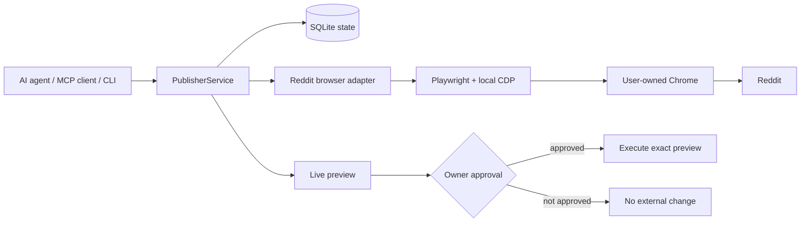

# Reddit Agent Publisher

[](https://github.com/Bl0ck154/reddit-agent-publisher/actions/workflows/ci.yml)
[](https://github.com/Bl0ck154/reddit-agent-publisher/releases/latest)
[](LICENSE)
[](package.json)

**A self-hosted, human-approved Reddit publishing bridge for AI agents and MCP clients.**

Reddit Agent Publisher connects a narrow application interface to **your own authenticated Reddit browser session**. It does not require Reddit Data API credentials: authentication stays inside Chrome while the application manages drafts, live previews, approvals, local state, and audit history.

The core workflow is deliberately simple:

> **prepare → preview → approve → execute**

Nothing is submitted during preparation or preview. An external change is only executed after approval of the exact current preview.

## Why this project exists

Generic browser agents are powerful, but they also expose a very large browser surface. Reddit Agent Publisher narrows that surface to a small publishing-oriented interface with explicit state transitions and approval checks.

Instead of giving an AI agent unrestricted browser control, the agent works through a purpose-built publisher layer that knows about Reddit posts, comments, edits, deletes, subreddit rules, flairs, previews, and approval state.

## Features

| Capability | Status |
| --- | --- |
| Create Reddit posts | ✅ |
| Create comments / replies | ✅ |
| Edit own content | ✅ |
| Delete own content | ✅ |
| Read subreddit rules | ✅ |
| Discover post flairs | ✅ |
| Live browser preview | ✅ |
| MCP server | ✅ |
| CLI | ✅ |
| Local SQLite state | ✅ |
| Hash-chained audit events | ✅ |
| OpenAPI 3.1 contract | ✅ |
| Hosted HTTP / GPT Actions gateway | Not bundled in the public edition |

## Architecture



## Requirements

- Node.js 22+
- npm
- Chrome, Chromium, or Chrome for Testing
- a Reddit account

## Quick start

```bash
git clone https://github.com/Bl0ck154/reddit-agent-publisher.git
cd reddit-agent-publisher
npm install
npm run build
```

The public edition connects to a **local Chrome DevTools Protocol endpoint**. Chrome is started and controlled by you; this project does not store your Reddit password or manage browser credentials.

Default endpoint:

```text
http://127.0.0.1:9222
```

A typical local Chrome launch looks like this:

```bash
google-chrome --remote-debugging-port=9222 --user-data-dir="$HOME/.reddit-agent-publisher-chrome"
```

Executable names differ between operating systems and Chrome distributions. Log in to Reddit manually in that Chrome profile, then keep the browser available while the publisher is running.

To use another **local** CDP port:

```bash
export PUBLISHER_CDP_URL=http://127.0.0.1:9333
```

Remote CDP hosts are intentionally rejected.

## MCP setup

After building the project, point your MCP client at `dist/mcp.js`.

Example configuration:

```json
{
  "mcpServers": {
    "reddit-agent-publisher": {
      "command": "node",
      "args": ["/absolute/path/reddit-agent-publisher/dist/mcp.js"]
    }
  }
}
```

The MCP server exposes a narrow tool set around the publishing state machine, including preparation, preview, approval, execution, account status, subreddit rules, flair discovery, pending drafts, and diagnostics.

## CLI

The repository also includes `src/cli.ts`, compiled to `dist/cli.js`.

```bash
node dist/cli.js --help
node dist/cli.js status
node dist/cli.js doctor
```

The CLI and MCP server use the same `PublisherService`, state database, validation rules, and approval model.

## Approval and safety model

A few design decisions are intentional:

- **Preview first.** The Reddit form is prepared before any external mutation.
- **Digest-bound approval.** Approval is tied to the exact preview digest and revision.
- **Expiring approval.** Old approvals cannot be reused indefinitely.
- **Canonical targets.** Edit/delete operations are bound to canonical Reddit post/comment URLs.
- **Local browser boundary.** The CDP endpoint must resolve to localhost.
- **Account write lock.** Concurrent mutations for the same account are rejected.
- **Audit trail.** Local audit events are hash-chained.
- **Manual authentication challenges.** CAPTCHA, 2FA, consent, and account challenges stay in the user-owned browser.

## Local state

By default, application state is stored under:

```text
~/.local/share/reddit-agent-publisher
```

You can override this with `PUBLISHER_STATE_DIR`.

The state directory contains the SQLite database, preview artifacts, and temporary files. Runtime state, databases, logs, and environment files are excluded by `.gitignore`.

## OpenAPI / GPT Actions

`src/actions-schema.ts` contains a Reddit-only OpenAPI 3.1 contract for integrations that want an HTTP layer.

The public repository currently **does not bundle a hosted HTTP gateway**. The schema is included as an integration boundary, while the working public interfaces are the CLI and MCP server.

## Project structure

```text
src/
├── adapters/
│   ├── base.ts
│   └── reddit-browser.ts
├── tests/
├── actions-schema.ts
├── cli.ts
├── config.ts
├── db.ts
├── external-chrome.ts
├── mcp.ts
├── service.ts
└── types.ts
```

## Development

```bash
npm ci
npm run check
```

`npm run check` builds the TypeScript project and runs the test suite. The same check runs in GitHub Actions on pushes and pull requests.

## Release history

See [CHANGELOG.md](CHANGELOG.md). The latest public release is available on the [Releases](https://github.com/Bl0ck154/reddit-agent-publisher/releases) page.

## Limitations

Reddit Agent Publisher works against the website UI, so Reddit frontend changes can require selector maintenance. It is not intended to hide automation from Reddit or bypass account challenges. Authentication, CAPTCHA, 2FA, consent, and similar user-verification steps remain manual.

This project is not affiliated with or endorsed by Reddit.

## Contributing

See [CONTRIBUTING.md](CONTRIBUTING.md). Security-related reports should follow [SECURITY.md](SECURITY.md).

## License

MIT — see [LICENSE](LICENSE).
